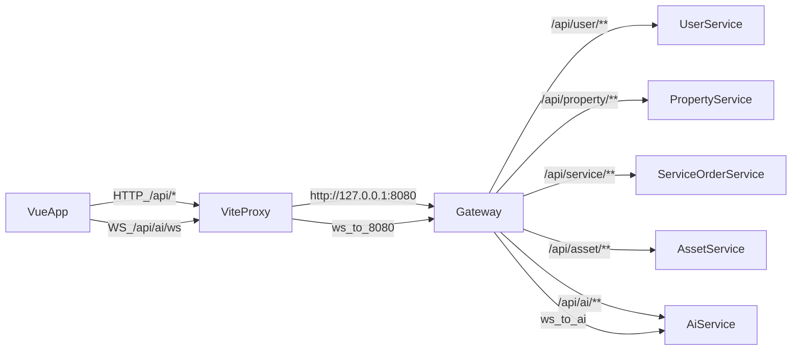

## 目标

- 让前端所有请求都能**通过 Gateway 的路由规范**访问到对应后端服务：`/api/user/**`、`/api/property/**`、`/api/service/**`、`/api/asset/**`、`/api/ai/**`（来自设计文档第 4 部分）。
- 认证流程以你选择的 **邮箱+验证码注册**为主：前端调用 `user-service` 的 `/auth/send-code` + `/auth/register-email` + `/auth/login` + `/auth/me`。

## 现状定位（已确认的问题点）

- 前端 axios baseURL 是 `VITE_API_BASE_URL || '/api'`，并且 Vite 已代理 `'/api' -> http://127.0.0.1:8080`：见 [d:/code/Home-Care-Connect/frontend/src/utils/request.ts](d:/code/Home-Care-Connect/frontend/src/utils/request.ts) 与 [d:/code/Home-Care-Connect/frontend/vite.config.ts](d:/code/Home-Care-Connect/frontend/vite.config.ts)。
- 但当前前端 API 文件普遍调用的是 `'/auth/login'`、`'/properties'`、`'/orders'` 这类**缺少服务前缀**的路径（例如 [d:/code/Home-Care-Connect/frontend/src/api/auth.ts](d:/code/Home-Care-Connect/frontend/src/api/auth.ts)）。在 Gateway 路由为 `/api/user/**` 的前提下，这些请求会变成 `/api/auth/login`，无法匹配路由，从而“看起来没有做前后端对接”。
- AI WebSocket 目前走 `VITE_WS_URL || ws://127.0.0.1:8000` 且连接 `${WS_URL}/api/ai/ws/chat?...`（见 [d:/code/Home-Care-Connect/frontend/src/api/ai.ts](d:/code/Home-Care-Connect/frontend/src/api/ai.ts)），但设计文档期望 WebSocket 能通过 Nginx/Gateway 的 `/api/ai/ws` 统一入口；开发期也应尽量走同源 `ws(s)://<frontend-host>/api/ai/ws...` 以减少跨域与端口差异。

## 关键对接规则（本次统一采用）

- **HTTP baseURL**: 前端保持 `'/api'` 不变（已经有 proxy 到 `8080`）。
- **各业务模块请求路径**（因为 baseURL 已包含 `/api`，所以这里写的是“模块前缀/资源路径”）：
  - user-service：`/user/auth/...`
  - property-service：`/property/...`
  - service-order：`/service/...`
  - asset-service：`/asset/...`
  - ai-service：`/ai/...`
- **WebSocket**：优先 `ws(s)://<当前站点>/api/ai/ws?...`（由 Vite proxy / Nginx 反代到 Gateway），避免直连 `8000`。

## 拟改动点（高优先级）

- 前端 API 路径加模块前缀并对齐设计文档：
  - [d:/code/Home-Care-Connect/frontend/src/api/auth.ts](d:/code/Home-Care-Connect/frontend/src/api/auth.ts)：
    - `'/auth/*'` → `'/user/auth/*'`（对应后端 `AuthController` 的 `@RequestMapping("/auth")`，通过 Gateway `/api/user/**` StripPrefix 后可正确落到 user-service）。
  - [d:/code/Home-Care-Connect/frontend/src/api/property.ts](d:/code/Home-Care-Connect/frontend/src/api/property.ts)：
    - `'/properties'` → `'/property/properties'`
    - `'/viewings'`/`'/viewings/my'` 等按网关规范改为 `'/property/viewings'`...
  - [d:/code/Home-Care-Connect/frontend/src/api/service.ts](d:/code/Home-Care-Connect/frontend/src/api/service.ts)：
    - 现有 `'/service-types'` 与设计文档 `GET /types` 不一致，统一改为 `'/service/types'`，订单为 `'/service/orders'`...
    - 同时清理 `cancel/pay/confirm` 这类设计文档未定义的端点：要么改成后端已实现的端点，要么先在前端隐藏按钮，避免无效调用。
  - [d:/code/Home-Care-Connect/frontend/src/api/asset.ts](d:/code/Home-Care-Connect/frontend/src/api/asset.ts)：
    - `'/procurement-products'` → `'/asset/products'`
    - `'/secondhand-items'` → `'/asset/secondhand'`
- AI API/WS 对齐：
  - [d:/code/Home-Care-Connect/frontend/src/api/ai.ts](d:/code/Home-Care-Connect/frontend/src/api/ai.ts)：
    - HTTP：设计文档为 `POST /api/ai/chat`，当前是 `GET /ai/chat`；需要按后端实际实现对齐（若后端尚未实现，则在后端补 `POST /chat` 并返回统一 `Result`）。
    - WS：改为同源 `new WebSocket(`${wsBase}/api/ai/ws?token=${accessToken}`)`（token 由前端现有 localStorage 获取），开发期通过 Vite 代理转发。
  - [d:/code/Home-Care-Connect/frontend/vite.config.ts](d:/code/Home-Care-Connect/frontend/vite.config.ts)：将 `'/ws'` 代理调整为对 `'/api/ai/ws'` 的 ws 代理（或直接让 `'/api'` 这条 proxy 支持 ws，并把 ws 也走 `'/api'`）。

## 后端需要核对/补齐的最小项（确保能联调）

- user-service 已有：`POST /auth/login`、`POST /auth/register-email`、`POST /auth/send-code`、`GET /auth/me`（见 [d:/code/Home-Care-Connect/services/user-service/src/main/java/com/homecare/user/controller/AuthController.java](d:/code/Home-Care-Connect/services/user-service/src/main/java/com/homecare/user/controller/AuthController.java)）。
- 需要确认 gateway 是否已按设计文档配置路由与 StripPrefix（若缺失，前端再正确也进不去）。我会在实施前检查 `services/gateway` 的路由配置位置与生效方式（Nacos 或本地 yml）。

## 联调验证方式（实现后立刻验证）

- 在前端跑 `vite dev`，通过浏览器 Network 验证实际请求为：
  - `POST /api/user/auth/send-code`
  - `POST /api/user/auth/register-email`
  - `POST /api/user/auth/login`
  - `GET /api/user/auth/me`（带 `Authorization: Bearer ...`）
- 若返回 401，确认后端 `Result` 的 `code` 是否为 200（`frontend/src/utils/request.ts` 会把 `code!==200` 直接当错误）。

